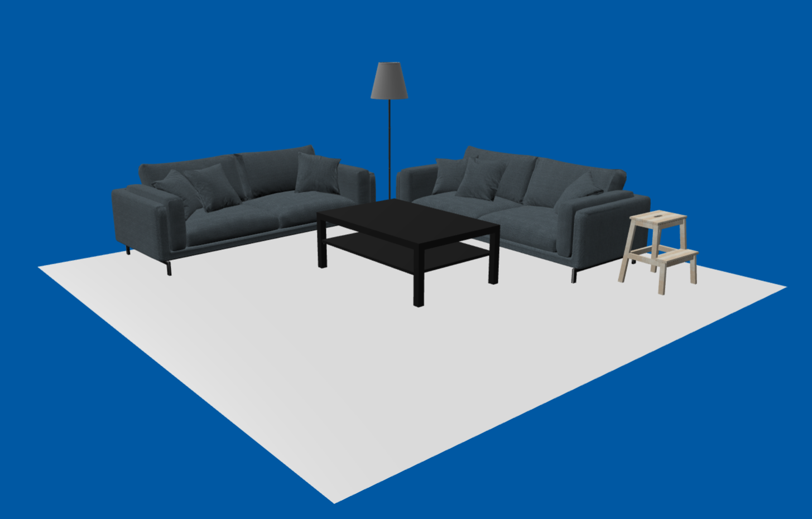

# Web 3D Demo
A 3D demo for the web, using Babylon.js and TypeScript.

# Features
- Mesh-instancing.
- Babylon-abstraction (WIP).
- Multiple canvases with their own environment.

[Documented improvements that can be made.](src/improvements.md)

# Build and Run
`npm run build`
`npm run start`

# Models
[See 'credits.txt' in /public/models/.](public/models/credits.txt)